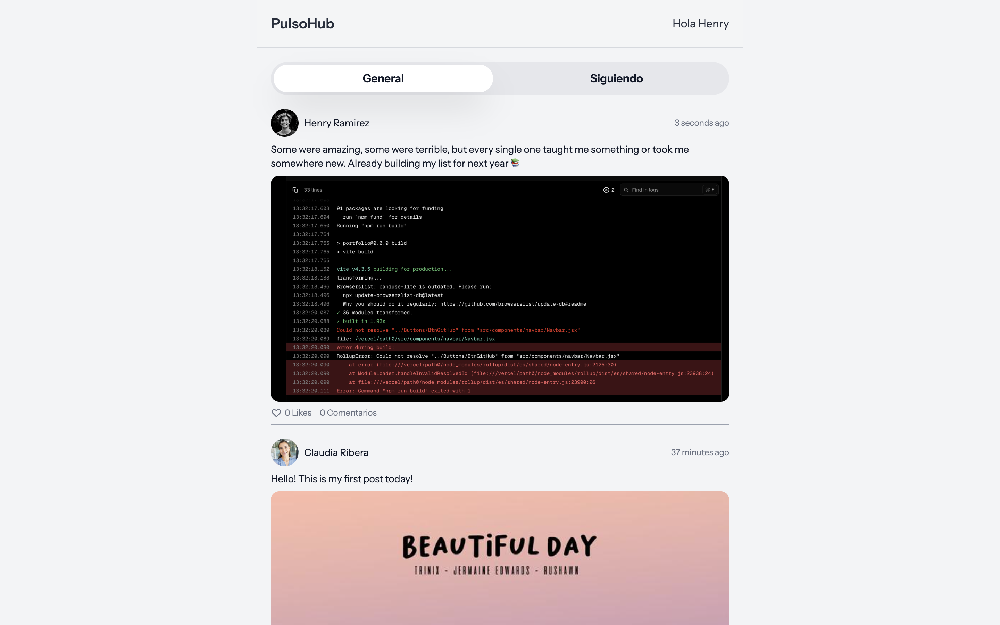
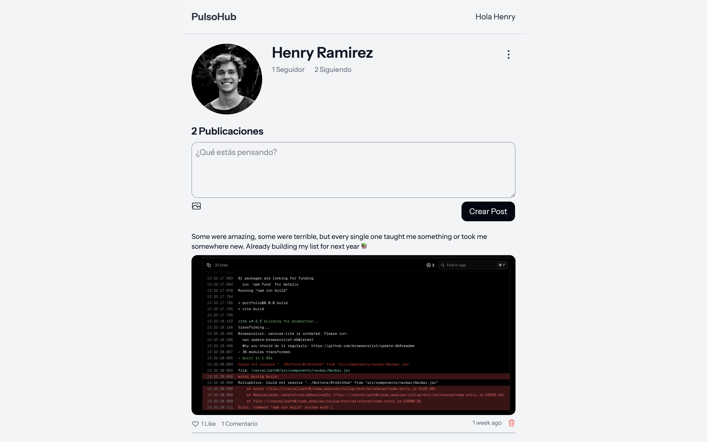
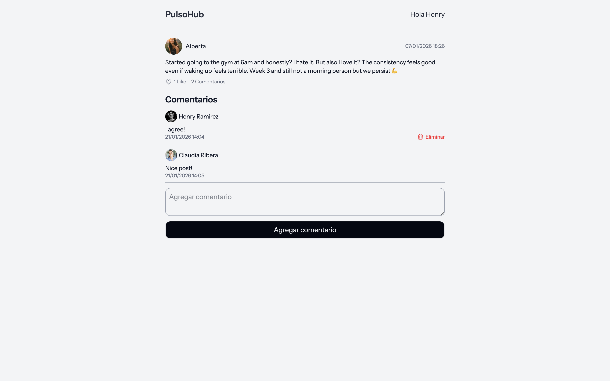

# 🚀 PulsoHub

<div align="center">
  


</div>

---

## 📋 Descripción

PulsoHub es una red social full-stack desarrollada con Laravel que permite a los usuarios crear perfiles, publicar contenido, interactuar con otros usuarios y construir una comunidad. El proyecto demuestra el dominio de conceptos clave del desarrollo web moderno, incluyendo autenticación, CRUD operations, relaciones de base de datos y componentes reactivos.

## ✨ Características

### 👤 Gestión de Usuarios
- ✅ Sistema completo de autenticación (registro, login, logout)
- ✅ Perfiles de usuario personalizables
- ✅ Edición de perfil (nombre, biografía, foto de perfil)
- ✅ Sistema de seguimiento entre usuarios (follow/unfollow)

### 📝 Gestión de Publicaciones
- ✅ Crear, editar y eliminar posts
- ✅ Feed principal con posts de todos los usuarios
- ✅ Vista de perfil con posts del usuario específico
- ✅ Vista detallada individual de cada post

### 💬 Interacciones Sociales
- ✅ Sistema de likes en publicaciones
- ✅ Comentarios en posts
- ✅ Visualización de actividad del usuario
- ✅ Contador de seguidores y seguidos

## 🛠 Tecnologías

### Backend
- **Laravel** - Framework PHP moderno y robusto
- **MySQL** - Sistema de gestión de base de datos
- **Livewire** - Componentes dinámicos sin escribir JavaScript

### Frontend
- **Tailwind CSS** - Framework CSS utility-first
- **Blade Templates** - Motor de plantillas de Laravel
- **Vite** - Build tool para desarrollo rápido

### Herramientas de Desarrollo
- **Laravel Vite Plugin** - Integración de Vite con Laravel
- **Composer** - Gestor de dependencias PHP
- **NPM** - Gestor de paquetes Node.js

## 🚀 Instalación

### Requisitos Previos
- PHP >= 8.2
- Composer
- Node.js
- MySQL
- Git

### Pasos de Instalación

1. **Clonar el repositorio**
```bash
git clone https://github.com/tu-usuario/pulsohub.git
cd pulsohub
```

2. **Instalar dependencias de PHP**
```bash
composer install
```

3. **Instalar dependencias de Node.js**
```bash
npm install
```

4. **Configurar variables de entorno**
```bash
cp .env.example .env
php artisan key:generate
```

5. **Configurar la base de datos**

Edita el archivo `.env` con tus credenciales de MySQL:
```env
DB_CONNECTION=mysql
DB_HOST=127.0.0.1
DB_PORT=3306
DB_DATABASE=pulsohub
DB_USERNAME=tu_usuario
DB_PASSWORD=tu_contraseña
```

6. **Crear la base de datos**
```bash
mysql -u root -p
CREATE DATABASE pulsohub;
exit;
```

7. **Ejecutar migraciones**
```bash
php artisan migrate
```

8. **(Opcional) Generar datos de prueba**
```bash
php artisan db:seed
```

9. **Compilar assets**
```bash
npm run dev
```

10. **Iniciar el servidor de desarrollo**

**Si usas Laravel Valet:**
```bash
valet link pulsohub
```
La aplicación estará disponible en: `http://pulsohub.test/home`

**Si no usas Valet:**

En una terminal separada:
```bash
php artisan serve
```
La aplicación estará disponible en: `http://localhost:8000`
## 💻 Uso

### Crear una Cuenta
1. Navega a la página de registro
2. Completa el formulario con tus datos
3. Inicia sesión con tus credenciales

### Crear un Post
1. Ve a tu perfil
2. Escribe tu contenido
3. Haz clic en "Crear Post"
3. Publica y aparecerá en el feed principal

### Interactuar con Usuarios
1. Explora posts en el home
2. Dale like a publicaciones que te gusten
3. Comenta en posts de otros usuarios
4. Visita perfiles y sigue a otros usuarios

### Editar tu Perfil
1. Ve a tu perfil
2. Haz clic en el ícono de los 3 puntos y luego en "Editar Perfil"
3. Actualiza tu información y foto
4. Guarda los cambios

## 📸 Capturas de Pantalla

### Home - Feed Principal

*Vista principal con todos los posts de los usuarios*

### Perfil de Usuario

*Perfil mostrando posts del usuario*

### Detalle de Post

*Vista completa de un post con likes y comentarios*

### Editar Perfil

*Interfaz para actualizar información del usuario*

## 🗃 Modelo de Base de Datos

### Tablas Principales
- **users** - Información de usuarios (nombre, email, foto, biografía)
- **posts** - Publicaciones de usuarios
- **comments** - Comentarios en posts
- **likes** - Likes en publicaciones
- **follows** - Relaciones de seguimiento entre usuarios

### Relaciones
- Un usuario puede tener muchos posts
- Un usuario puede tener muchos comentarios
- Un usuario puede dar muchos likes
- Un usuario puede seguir a muchos usuarios
- Un post puede tener muchos comentarios
- Un post puede tener muchos likes


---

<div align="center">
  
  **⭐ Si te gusta este proyecto, no olvides darle una estrella en GitHub ⭐**
  
  Desarrollado con ❤️ usando Laravel
  
</div>
